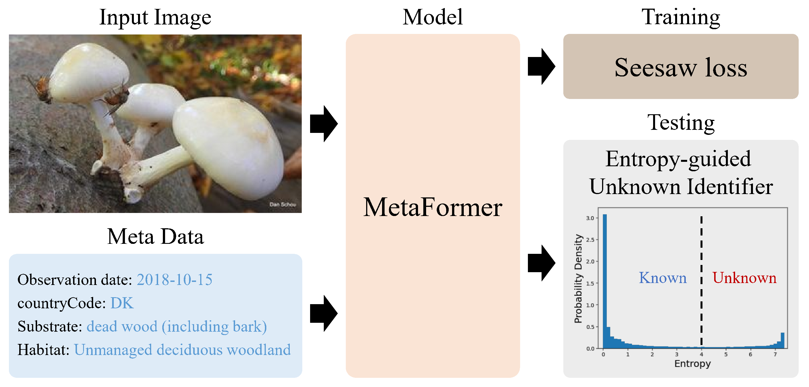

# Entropy-guided Open-set Fine-grained Fungi Recognition

Huan Ren, Han Jiang, Wang Luo, Meng Meng, Tianzhu Zhang (USTC)



## Description

This repository contains the code for the [FungiCLEF2023](https://www.imageclef.org/FungiCLEF2023) competition from UstcAIGroup. The majority of the code in this repository is sourced from [fgvc9_fungiclef](https://github.com/guoshengcv/fgvc9_fungiclef). The main differences lie in the `custom_loss.py` and `post_avg_entropy.py` files.

* In the `custom_loss.py` file, we have implemented the **poisonous/edible classification loss** for enhanced identification of poisonous species. Additionally, we have included a uniform distribution constraint specifically for the novel category in the validation set.

* In the `post_avg_entropy.py` file, we have implemented the **Entropy-guided Unknown Identifier** to leverage entropy for distinguishing novel categories.

## Requirements

You can get started by following these steps:

1. Create a new conda environment and activate the new environment:
```
conda create -n MetaFormer python=3.8
conda activate MetaFormer
```

2. Install [PyTorch](https://pytorch.org/):
```
conda install pytorch==1.8.0 torchvision==0.9.0 torchaudio==0.8.0 cudatoolkit=11.1 -c pytorch -c conda-forge
```

3. Install additional required packages using pip:
```
pip install -r requirements.txt
```

4. Install [Apex](https://github.com/NVIDIA/apex):
```
git clone https://github.com/NVIDIA/apex
cd apex
# if pip >= 23.1 (ref: https://pip.pypa.io/en/stable/news/#v23-1) which supports multiple `--config-settings` with the same key... 
pip install -v --disable-pip-version-check --no-cache-dir --no-build-isolation --config-settings "--build-option=--cpp_ext" --config-settings "--build-option=--cuda_ext" ./
# otherwise
pip install -v --disable-pip-version-check --no-cache-dir --no-build-isolation --global-option="--cpp_ext" --global-option="--cuda_ext" ./
```
If you encounter the error `No module named 'packaging'`, you can refer to [this issue](https://github.com/NVIDIA/apex/issues/1594). One way to fix it is by running `conda install packaging` beforehand.

## Data Preparation

1. Download the challenge image data (we use the full size version) and metadata from [competition website](https://www.imageclef.org/FungiCLEF2023).

2. Download the [CSV file](http://ptak.felk.cvut.cz/plants//DanishFungiDataset/poison_status_list.csv) indicating whether each category is poisonous.

3. Download the pretrained model from the model zoo of [MetaFormer](https://github.com/dqshuai/MetaFormer).

4. Place the datasets inside `datasets/fungi/challenge_data/` and pretrained model into `pretrained_model/`. Make sure the data structure is as below.

```
├── datasets
│   └── fungi
│       └── challenge_data
│           ├── DF20
│           │   ├── 2237851949-74654.JPG
│           │   └── 2237851951-222637.JPG
│           ├── DF21
│           ├── ├── 0-3008822340.JPG
│           ├── └── 0-3008822343.JPG
│           ├── poison_status_list.csv
│           ├── test.csv
│           ├── train.csv
│           └── val.csv
├── pretrained_model
│   ├── metafg_0_inat21_384.pth
│   └── metafg_2_inat21_384.pth
```

## Running

### Training

```
bash run_train.sh
```

### Inference

```
bash run_inference.sh
```

### Post process

After running inference, you will get `result{0-rank}.pkl` which indicate the output of a single model. Here we give an example:
```
├── fungi_pkl_ensemble
│   ├── MetaFG_meta_0_384_bs36_epoch80_poison_trainval
│   │   ├── result0.pkl
│   │   ├── result1.pkl
│   │   ├── result2.pkl
│   │   └── result3.pkl
│   ├── MetaFG_meta_2_384_bs18_epoch64_poison_trainval
│   │   ├── result0.pkl
│   │   ├── result1.pkl
│   │   ├── result2.pkl
│   └── └── result3.pkl
```

You can average ensemble the results and post process with our proposed **Entropy-guided Unknown Identifier**:
```
python post_avg_entropy.py
```

## Results

### Public leaderboard of FungiCLEF2023 competition.

| Rank  | Team Name   | F1 ($\uparrow$) | Track1 ($\downarrow$) | Track2 ($\downarrow$) | Track3 ($\downarrow$) | Track4 ($\downarrow$) |
| ----- | ----------- | --------------- | --------------------- | --------------------- | --------------------- | --------------------- |
| **1** | **meng18**  | **58.95** | **0.2072** | **0.1742** | **0.3814** | **1.4762** |
| 2     | stefanwolf  | 56.27     | 0.3528     | 0.2133     | 0.5662     | 2.9296     |
| 3     | word2vector | 55.46     | 0.3519     | 0.2561     | 0.6080     | 2.8167     |
| 4     | SSSAMMMM    | 52.76     | 0.4124     | 0.3270     | 0.7395     | 3.3302     |

### Private leaderboard of FungiCLEF2023 competition.

| Rank  | Team Name   | F1 ($\uparrow$) | Track1 ($\downarrow$) | Track2 ($\downarrow$) | Track3 ($\downarrow$) | Track4 ($\downarrow$) |
| ----- | ----------- | --------------- | --------------------- | --------------------- | --------------------- | --------------------- |
| **1** | **meng18**  | **58.36** | **0.2409** | **0.1269** | **0.3702** | **1.7710** |
| 2     | stefanwolf  | 55.31     | 0.3473     | 0.1904     | 0.5560     | 1.9045     |
| 3     | word2vector | 54.34     | 0.3601     | 0.2324     | 0.6034     | 2.9269     |
| 4     | SSSAMMMM    | 51.67     | 0.4408     | 0.3264     | 0.7673     | 3.6493     |

## Acknowledgements

We referenced the repos below for the code.

* [fgvc9_fungiclef](https://github.com/guoshengcv/fgvc9_fungiclef)

* [MetaFormer](https://github.com/dqshuai/MetaFormer)
